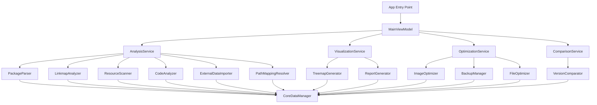

# Design Document: iOS App Analyzer

## Overview

iOS App Analyzer是一个专业的macOS应用程序，采用SwiftUI + CoreData + MVVM架构，专门用于分析iOS应用的包大小分布。该工具通过解析.ipa/.app文件、linkmap.txt文件和项目目录，将多源数据映射到统一的项目目录结构中，生成交互式treemap可视化图表，并提供无用资源和代码的检测与优化功能。

核心技术特点：
- 基于项目目录结构的多源数据映射和可视化
- 高性能treemap布局引擎实现交互式图表
- 静态分析结合外部数据的无用内容检测
- 本地离线处理，保护用户隐私
- 专业级HTML报告生成

## Architecture

### 整体架构

采用MVVM (Model-View-ViewModel) 架构模式，结合SwiftUI的声明式UI和CoreData的数据持久化：

```
┌─────────────────┐    ┌─────────────────┐    ┌─────────────────┐
│   SwiftUI Views │◄──►│   ViewModels    │◄──►│   Data Models   │
└─────────────────┘    └─────────────────┘    └─────────────────┘
                                │
                                ▼
                       ┌─────────────────┐
                       │  Service Layer  │
                       └─────────────────┘
                                │
                                ▼
                       ┌─────────────────┐
                       │   CoreData      │
                       └─────────────────┘
```

### 核心服务架构



## Components and Interfaces

### 1. Data Models

#### AnalysisProject (CoreData Entity)
```swift
@objc(AnalysisProject)
public class AnalysisProject: NSManagedObject {
    @NSManaged public var id: UUID
    @NSManaged public var name: String
    @NSManaged public var projectPath: String?
    @NSManaged public var ipaPath: String?
    @NSManaged public var linkmapPath: String?
    @NSManaged public var createdAt: Date
    @NSManaged public var updatedAt: Date
    @NSManaged public var totalSize: Int64
    @NSManaged public var analysisResults: Set<AnalysisResult>
}
```

#### AnalysisResult (CoreData Entity)
```swift
@objc(AnalysisResult)
public class AnalysisResult: NSManagedObject {
    @NSManaged public var id: UUID
    @NSManaged public var relativePath: String
    @NSManaged public var fileName: String
    @NSManaged public var fileType: String
    @NSManaged public var codeSize: Int64
    @NSManaged public var resourceSize: Int64
    @NSManaged public var frameworkSize: Int64
    @NSManaged public var isUnusedResource: Bool
    @NSManaged public var isUnusedCode: Bool
    @NSManaged public var isExternallyMarked: Bool
    @NSManaged public var project: AnalysisProject
}
```

#### TreemapNode (Value Type)
```swift
struct TreemapNode: Identifiable, Hashable {
    let id = UUID()
    let name: String
    let relativePath: String
    let size: Int64
    let children: [TreemapNode]
    let isUnused: Bool
    let fileType: FileType
    let rect: CGRect // TreeMap布局计算结果
}

enum FileType: String, CaseIterable {
    case code = "Code"
    case resource = "Resource"
    case framework = "Framework"
    case directory = "Directory"
}
```

### 2. Service Layer

#### AnalysisService
```swift
protocol AnalysisServiceProtocol {
    func analyzeProject(
        projectPath: String?,
        ipaPath: String?,
        linkmapPath: String?,
        externalUnusedResources: [String]?,
        externalUnusedClasses: [String]?
    ) async throws -> AnalysisProject
    
    func getAnalysisHistory() async throws -> [AnalysisProject]
    func deleteAnalysis(_ project: AnalysisProject) async throws
    func exportAnalysisData(_ project: AnalysisProject) async throws -> Data
    func importAnalysisData(_ data: Data) async throws -> AnalysisProject
}

class AnalysisService: AnalysisServiceProtocol {
    private let packageParser: PackageParserProtocol
    private let linkmapAnalyzer: LinkmapAnalyzerProtocol
    private let resourceScanner: ResourceScannerProtocol
    private let codeAnalyzer: CodeAnalyzerProtocol
    private let externalDataImporter: ExternalDataImporterProtocol
    private let pathMappingResolver: PathMappingResolverProtocol
    private let coreDataManager: CoreDataManagerProtocol
}
```

#### PackageParser
```swift
protocol PackageParserProtocol {
    func parseIPA(at path: String) async throws -> [FileInfo]
    func parseApp(at path: String) async throws -> [FileInfo]
}

struct FileInfo {
    let relativePath: String
    let fileName: String
    let size: Int64
    let fileType: FileType
}
```

#### LinkmapAnalyzer
```swift
protocol LinkmapAnalyzerProtocol {
    func parseLinkmapFile(at path: String) async throws -> [SymbolInfo]
    func mapSymbolsToProjectStructure(
        symbols: [SymbolInfo],
        projectPath: String
    ) async throws -> [CodeSizeInfo]
}

struct SymbolInfo {
    let address: String
    let size: Int64
    let fileName: String
    let symbolName: String
}

struct CodeSizeInfo {
    let relativePath: String
    let fileName: String
    let totalSize: Int64
    let symbols: [SymbolInfo]
}
```

#### TreemapGenerator
```swift
protocol TreemapGeneratorProtocol {
    func generateTreemap(
        from analysisResults: [AnalysisResult],
        in bounds: CGRect
    ) -> TreemapNode
    
    func updateLayout(
        for node: TreemapNode,
        in bounds: CGRect
    ) -> TreemapNode
}

class TreemapGenerator: TreemapGeneratorProtocol {
    // 使用改进的Squarify算法实现高性能布局
    private func squarify(
        data: [TreemapData],
        bounds: CGRect
    ) -> [CGRect]
}
```

#### CodeAnalyzer
```swift
protocol CodeAnalyzerProtocol {
    func analyzeUnusedCode(
        from linkmapData: [SymbolInfo],
        projectPath: String
    ) async throws -> [UnusedCode]
    
    func detectUnusedClasses(
        in projectPath: String
    ) async throws -> [String]
    
    func estimateCodeSize(
        for className: String,
        in symbols: [SymbolInfo]
    ) -> Int64
}

class CodeAnalyzer: CodeAnalyzerProtocol {
    private let sourceCodeParser: SourceCodeParserProtocol
    private let dependencyAnalyzer: DependencyAnalyzerProtocol
    
    func analyzeUnusedCode(
        from linkmapData: [SymbolInfo],
        projectPath: String
    ) async throws -> [UnusedCode] {
        // 静态分析源代码，检测未使用的类和方法
        let sourceFiles = try await sourceCodeParser.parseProject(at: projectPath)
        let dependencies = try await dependencyAnalyzer.buildDependencyGraph(from: sourceFiles)
        
        // 结合linkmap数据进行交叉验证
        return try await identifyUnusedCode(dependencies: dependencies, symbols: linkmapData)
    }
}
```

#### ResourceScanner
```swift
protocol ResourceScannerProtocol {
    func scanProjectDirectory(at path: String) async throws -> [ResourceInfo]
    func detectUnusedResources(
        in project: String,
        using packageInfo: [FileInfo]
    ) async throws -> [UnusedResource]
    func buildPathMappingTable(
        projectPath: String,
        packageFiles: [FileInfo]
    ) async throws -> PathMappingTable
}

struct ResourceInfo {
    let relativePath: String
    let fileName: String
    let size: Int64
    let resourceType: ResourceType
}

struct PathMappingTable {
    let mappings: [String: String] // project path -> package path
    let conflicts: [PathMappingConflict]
    let unmappedFiles: [String]
    let accuracy: Double // mapping accuracy percentage
}

struct PathMappingConflict {
    let projectPath: String
    let candidatePackagePaths: [String]
    let recommendedResolution: String
}
```

#### ExternalDataImporter
```swift
protocol ExternalDataImporterProtocol {
    func importUnusedResourcesList(from filePath: String) async throws -> [String]
    func importUnusedClassesList(from filePath: String) async throws -> [String]
    func mergeWithLocalAnalysis(
        externalUnusedResources: [String],
        localUnusedResources: [UnusedResource]
    ) -> [UnusedResource]
    func mergeWithLocalAnalysis(
        externalUnusedClasses: [String],
        localUnusedCode: [UnusedCode]
    ) -> [UnusedCode]
}

class ExternalDataImporter: ExternalDataImporterProtocol {
    func importUnusedResourcesList(from filePath: String) async throws -> [String] {
        // 支持多种格式：JSON, CSV, TXT
        let fileExtension = URL(fileURLWithPath: filePath).pathExtension.lowercased()
        
        switch fileExtension {
        case "json":
            return try await parseJSONList(from: filePath)
        case "csv":
            return try await parseCSVList(from: filePath)
        case "txt":
            return try await parseTextList(from: filePath)
        default:
            throw ImportError.unsupportedFormat(fileExtension)
        }
    }
}
```

#### PathMappingResolver
```swift
protocol PathMappingResolverProtocol {
    func resolvePathMappings(
        projectPath: String,
        packageFiles: [FileInfo],
        linkmapSymbols: [SymbolInfo]
    ) async throws -> PathMappingResult
    
    func resolveConflicts(
        _ conflicts: [PathMappingConflict]
    ) async throws -> [PathMappingResolution]
}

struct PathMappingResult {
    let mappingTable: PathMappingTable
    let resolutions: [PathMappingResolution]
    let accuracyReport: MappingAccuracyReport
}

struct PathMappingResolution {
    let conflict: PathMappingConflict
    let selectedPath: String
    let confidence: Double
    let reasoning: String
}

struct MappingAccuracyReport {
    let totalFiles: Int
    let mappedFiles: Int
    let conflictedFiles: Int
    let unmappedFiles: Int
    let overallAccuracy: Double
    let recommendations: [String]
}
```

### 3. ViewModels

#### MainViewModel
```swift
@MainActor
class MainViewModel: ObservableObject {
    @Published var currentProject: AnalysisProject?
    @Published var analysisHistory: [AnalysisProject] = []
    @Published var isAnalyzing = false
    @Published var analysisProgress: Double = 0.0
    @Published var errorMessage: String?
    @Published var draggedFiles: [URL] = []
    
    private let analysisService: AnalysisServiceProtocol
    private let visualizationService: VisualizationServiceProtocol
    private let comparisonService: ComparisonServiceProtocol
    
    func startAnalysis(
        projectPath: String?,
        ipaPath: String?,
        linkmapPath: String?,
        externalUnusedResources: [String]? = nil,
        externalUnusedClasses: [String]? = nil
    ) async
    
    func loadAnalysisHistory() async
    func deleteProject(_ project: AnalysisProject) async
    func compareProjects(_ project1: AnalysisProject, _ project2: AnalysisProject) async -> ProjectComparison
    func handleDroppedFiles(_ urls: [URL])
    func exportProject(_ project: AnalysisProject) async throws
    func importProject(from url: URL) async throws
}
```

#### TreemapViewModel
```swift
@MainActor
class TreemapViewModel: ObservableObject {
    @Published var rootNode: TreemapNode?
    @Published var currentNode: TreemapNode?
    @Published var selectedNode: TreemapNode?
    @Published var searchText = ""
    @Published var showUnusedOnly = false
    @Published var hoveredNode: TreemapNode?
    @Published var navigationHistory: [TreemapNode] = []
    
    private let treemapGenerator: TreemapGeneratorProtocol
    
    func generateTreemap(from project: AnalysisProject, in bounds: CGRect)
    func drillDown(to node: TreemapNode)
    func drillUp()
    func navigateToRoot()
    func search(text: String)
    func toggleUnusedFilter()
    func handleNodeHover(_ node: TreemapNode?)
}
```

#### OptimizationViewModel
```swift
@MainActor
class OptimizationViewModel: ObservableObject {
    @Published var selectedUnusedResources: Set<UnusedResource> = []
    @Published var selectedUnusedCode: Set<UnusedCode> = []
    @Published var isOptimizing = false
    @Published var optimizationProgress: Double = 0.0
    @Published var optimizationResults: OptimizationResults?
    @Published var backupLocation: URL?
    
    private let optimizationService: OptimizationServiceProtocol
    
    func selectAllUnusedResources()
    func selectAllUnusedCode()
    func clearSelection()
    func estimateOptimizationSavings() -> OptimizationEstimate
    func performOptimization() async throws
    func createBackup() async throws -> URL
    func restoreFromBackup(_ backupUrl: URL) async throws
}

struct OptimizationResults {
    let originalSize: Int64
    let optimizedSize: Int64
    let savedSize: Int64
    let processedFiles: Int
    let failedFiles: [String]
    let backupLocation: URL
}

struct OptimizationEstimate {
    let estimatedSavings: Int64
    let affectedFiles: Int
    let riskLevel: RiskLevel
    let recommendations: [String]
}

enum RiskLevel {
    case low, medium, high
}
```

#### ComparisonViewModel
```swift
@MainActor
class ComparisonViewModel: ObservableObject {
    @Published var selectedProjects: [AnalysisProject] = []
    @Published var comparisonResult: ProjectComparison?
    @Published var isComparing = false
    
    private let comparisonService: ComparisonServiceProtocol
    
    func addProjectToComparison(_ project: AnalysisProject)
    func removeProjectFromComparison(_ project: AnalysisProject)
    func performComparison() async throws
    func exportComparisonReport() async throws -> URL
}

struct ProjectComparison {
    let projects: [AnalysisProject]
    let sizeChanges: [SizeChange]
    let newFiles: [String]
    let removedFiles: [String]
    let modifiedFiles: [FileChange]
    let summary: ComparisonSummary
}

struct SizeChange {
    let category: String
    let oldSize: Int64
    let newSize: Int64
    let change: Int64
    let changePercentage: Double
}

struct FileChange {
    let filePath: String
    let oldSize: Int64
    let newSize: Int64
    let changeType: ChangeType
}

enum ChangeType {
    case added, removed, modified, unchanged
}
```

### 4. SwiftUI Views

#### MainView
```swift
struct MainView: View {
    @StateObject private var mainViewModel = MainViewModel()
    @State private var selectedTab = 0
    
    var body: some View {
        NavigationSplitView {
            SidebarView(viewModel: mainViewModel)
        } detail: {
            TabView(selection: $selectedTab) {
                AnalysisView(viewModel: mainViewModel)
                    .tabItem { Label("Analysis", systemImage: "chart.pie") }
                    .tag(0)
                
                TreemapView(project: mainViewModel.currentProject)
                    .tabItem { Label("Visualization", systemImage: "square.grid.3x3") }
                    .tag(1)
                
                OptimizationView(project: mainViewModel.currentProject)
                    .tabItem { Label("Optimization", systemImage: "wand.and.stars") }
                    .tag(2)
                
                ComparisonView(projects: mainViewModel.analysisHistory)
                    .tabItem { Label("Comparison", systemImage: "arrow.left.arrow.right") }
                    .tag(3)
            }
        }
        .onDrop(of: [.fileURL], isTargeted: nil) { providers in
            mainViewModel.handleDroppedFiles(providers.compactMap { $0.url })
            return true
        }
        .keyboardShortcut(.init(.return), modifiers: [.command]) {
            // 快捷键：开始分析
        }
        .keyboardShortcut(.init("o"), modifiers: [.command]) {
            // 快捷键：打开文件
        }
        .keyboardShortcut(.init("s"), modifiers: [.command]) {
            // 快捷键：保存报告
        }
    }
}
```

#### AnalysisView
```swift
struct AnalysisView: View {
    @ObservedObject var viewModel: MainViewModel
    @State private var showingFilePicker = false
    @State private var showingExternalDataImporter = false
    
    var body: some View {
        VStack(spacing: 20) {
            // 文件输入区域
            FileInputSection(viewModel: viewModel)
            
            // 外部数据导入
            ExternalDataSection(
                showingImporter: $showingExternalDataImporter,
                viewModel: viewModel
            )
            
            // 分析进度
            if viewModel.isAnalyzing {
                AnalysisProgressView(
                    progress: viewModel.analysisProgress,
                    currentOperation: viewModel.currentOperation
                )
            }
            
            // 分析结果摘要
            if let project = viewModel.currentProject {
                AnalysisSummaryView(project: project)
            }
            
            Spacer()
        }
        .padding()
        .navigationTitle("iOS App Analysis")
        .toolbar {
            ToolbarItem(placement: .primaryAction) {
                Button("Start Analysis") {
                    Task {
                        await viewModel.startAnalysis()
                    }
                }
                .disabled(viewModel.isAnalyzing || !viewModel.hasValidInput)
            }
        }
    }
}
```

#### OptimizationView
```swift
struct OptimizationView: View {
    let project: AnalysisProject?
    @StateObject private var viewModel = OptimizationViewModel()
    @State private var showingBackupDialog = false
    
    var body: some View {
        VStack {
            if let project = project {
                ScrollView {
                    VStack(alignment: .leading, spacing: 20) {
                        // 优化摘要
                        OptimizationSummaryCard(
                            estimate: viewModel.estimateOptimizationSavings()
                        )
                        
                        // 无用资源列表
                        UnusedResourcesSection(
                            resources: project.unusedResources,
                            selectedResources: $viewModel.selectedUnusedResources
                        )
                        
                        // 无用代码列表
                        UnusedCodeSection(
                            code: project.unusedCode,
                            selectedCode: $viewModel.selectedUnusedCode
                        )
                    }
                }
                
                // 操作按钮
                HStack {
                    Button("Create Backup") {
                        showingBackupDialog = true
                    }
                    
                    Spacer()
                    
                    Button("Optimize Selected") {
                        Task {
                            try await viewModel.performOptimization()
                        }
                    }
                    .disabled(viewModel.selectedUnusedResources.isEmpty && 
                             viewModel.selectedUnusedCode.isEmpty)
                    .buttonStyle(.borderedProminent)
                }
                .padding()
            } else {
                ContentUnavailableView(
                    "No Analysis Available",
                    systemImage: "chart.pie",
                    description: Text("Run an analysis first to see optimization options")
                )
            }
        }
        .navigationTitle("Optimization")
        .alert("Create Backup", isPresented: $showingBackupDialog) {
            Button("Create") {
                Task {
                    try await viewModel.createBackup()
                }
            }
            Button("Cancel", role: .cancel) { }
        } message: {
            Text("A backup will be created before performing any optimization operations.")
        }
    }
}
```

#### ComparisonView
```swift
struct ComparisonView: View {
    let projects: [AnalysisProject]
    @StateObject private var viewModel = ComparisonViewModel()
    
    var body: some View {
        VStack {
            // 项目选择区域
            ProjectSelectionSection(
                projects: projects,
                selectedProjects: $viewModel.selectedProjects
            )
            
            if viewModel.selectedProjects.count >= 2 {
                Button("Compare Projects") {
                    Task {
                        try await viewModel.performComparison()
                    }
                }
                .buttonStyle(.borderedProminent)
                .disabled(viewModel.isComparing)
            }
            
            // 比较结果
            if let comparison = viewModel.comparisonResult {
                ScrollView {
                    ComparisonResultView(comparison: comparison)
                }
            }
            
            Spacer()
        }
        .padding()
        .navigationTitle("Project Comparison")
    }
}
```

#### TreemapView
```swift
struct TreemapView: View {
    let project: AnalysisProject?
    @StateObject private var viewModel = TreemapViewModel()
    @State private var viewBounds: CGRect = .zero
    
    var body: some View {
        VStack {
            TreemapControlsView(viewModel: viewModel)
            
            GeometryReader { geometry in
                TreemapCanvas(
                    node: viewModel.rootNode,
                    selectedNode: viewModel.selectedNode,
                    onNodeTap: viewModel.drillDown,
                    onNodeHover: { node in
                        // 显示详细信息
                    }
                )
                .onAppear {
                    viewBounds = geometry.frame(in: .local)
                    if let project = project {
                        viewModel.generateTreemap(from: project, in: viewBounds)
                    }
                }
                .onChange(of: geometry.size) { _, newSize in
                    viewBounds = CGRect(origin: .zero, size: newSize)
                    if let project = project {
                        viewModel.generateTreemap(from: project, in: viewBounds)
                    }
                }
            }
        }
    }
}
```

#### TreemapCanvas
```swift
struct TreemapCanvas: View {
    let node: TreemapNode?
    let selectedNode: TreemapNode?
    let onNodeTap: (TreemapNode) -> Void
    let onNodeHover: (TreemapNode?) -> Void
    
    var body: some View {
        Canvas { context, size in
            guard let node = node else { return }
            drawTreemapNode(context: context, node: node, in: size)
        }
        .gesture(
            DragGesture(minimumDistance: 0)
                .onEnded { value in
                    if let tappedNode = findNode(at: value.location, in: node) {
                        onNodeTap(tappedNode)
                    }
                }
        )
        .onHover { isHovering in
            // 处理鼠标悬停
        }
    }
    
    private func drawTreemapNode(
        context: GraphicsContext,
        node: TreemapNode,
        in size: CGSize
    ) {
        // 绘制treemap节点
        let color = colorForNode(node)
        let rect = node.rect
        
        context.fill(
            Path(rect),
            with: .color(color)
        )
        
        // 绘制边框
        context.stroke(
            Path(rect),
            with: .color(.primary),
            lineWidth: 1
        )
        
        // 绘制文本标签
        if rect.width > 50 && rect.height > 20 {
            let text = Text(node.name)
                .font(.caption)
                .foregroundColor(.primary)
            
            context.draw(text, at: CGPoint(
                x: rect.midX,
                y: rect.midY
            ))
        }
        
        // 递归绘制子节点
        for child in node.children {
            drawTreemapNode(context: context, node: child, in: size)
        }
    }
    
    private func colorForNode(_ node: TreemapNode) -> Color {
        if node.isUnused {
            return .red.opacity(0.7)
        }
        
        switch node.fileType {
        case .code:
            return .blue.opacity(0.6)
        case .resource:
            return .green.opacity(0.6)
        case .framework:
            return .orange.opacity(0.6)
        case .directory:
            return .gray.opacity(0.3)
        }
    }
}
```

## Data Models

### 核心数据结构

#### 项目目录映射结构
```swift
struct ProjectMapping {
    let projectPath: String
    let fileNodes: [FileNode]
    let directoryStructure: DirectoryNode
}

struct FileNode {
    let relativePath: String
    let fileName: String
    let codeSize: Int64      // 来自linkmap
    let resourceSize: Int64  // 来自ipa/app
    let frameworkSize: Int64 // 来自framework分析
    let isUnused: Bool       // 静态分析 + 外部数据
    let unusedSource: UnusedSource
}

enum UnusedSource {
    case staticAnalysis
    case externalData
    case both
}

struct DirectoryNode {
    let name: String
    let relativePath: String
    let children: [DirectoryNode]
    let files: [FileNode]
    let totalSize: Int64
    let unusedSize: Int64
}
```

### 分析结果数据模型
```swift
struct AnalysisResultData {
    let projectMapping: ProjectMapping
    let summary: AnalysisSummary
    let unusedResources: [UnusedResource]
    let unusedCode: [UnusedCode]
    let optimizationSuggestions: [OptimizationSuggestion]
    let pathMappingReport: MappingAccuracyReport
}

struct AnalysisSummary {
    let totalSize: Int64
    let codeSize: Int64
    let resourceSize: Int64
    let frameworkSize: Int64
    let unusedResourceSize: Int64
    let unusedCodeSize: Int64
    let potentialSavings: Int64
}

struct UnusedResource {
    let relativePath: String
    let fileName: String
    let size: Int64
    let resourceType: ResourceType
    let detectionMethod: UnusedSource
    let recommendedAction: RecommendedAction
}

enum ResourceType: String, CaseIterable {
    case image = "Image"
    case audio = "Audio"
    case video = "Video"
    case data = "Data"
    case other = "Other"
}

struct UnusedCode {
    let className: String
    let filePath: String
    let estimatedSize: Int64
    let detectionMethod: UnusedSource
    let dependencies: [String]
    let riskLevel: RiskLevel
}

struct OptimizationSuggestion {
    let type: OptimizationType
    let description: String
    let estimatedSavings: Int64
    let riskLevel: RiskLevel
    let actionRequired: String
}

enum OptimizationType {
    case imageCompression
    case unusedResourceRemoval
    case unusedCodeRemoval
    case duplicateFileRemoval
}

enum RecommendedAction {
    case safeToDelete
    case reviewRequired
    case keepForCompatibility
}
```

### 服务层扩展

#### OptimizationService
```swift
protocol OptimizationServiceProtocol {
    func compressImages(
        _ resources: [UnusedResource],
        compressionLevel: CompressionLevel
    ) async throws -> OptimizationResults
    
    func deleteUnusedResources(
        _ resources: [UnusedResource],
        createBackup: Bool
    ) async throws -> OptimizationResults
    
    func deleteUnusedCode(
        _ code: [UnusedCode],
        projectPath: String,
        createBackup: Bool
    ) async throws -> OptimizationResults
    
    func createBackup(
        for project: AnalysisProject
    ) async throws -> URL
    
    func restoreFromBackup(
        _ backupUrl: URL,
        to projectPath: String
    ) async throws
}

enum CompressionLevel {
    case conservative, balanced, aggressive
}
```

#### ReportGenerator
```swift
protocol ReportGeneratorProtocol {
    func generateHTMLReport(
        for project: AnalysisProject
    ) async throws -> URL
    
    func generateComparisonReport(
        _ comparison: ProjectComparison
    ) async throws -> URL
    
    func generateOptimizationReport(
        _ results: OptimizationResults
    ) async throws -> URL
}

class ReportGenerator: ReportGeneratorProtocol {
    func generateHTMLReport(for project: AnalysisProject) async throws -> URL {
        let template = try await loadHTMLTemplate()
        let treemapData = try await generateTreemapJSON(from: project)
        let unusedResourcesHTML = try await generateUnusedResourcesTable(from: project)
        let unusedCodeHTML = try await generateUnusedCodeTable(from: project)
        let summaryHTML = try await generateSummarySection(from: project)
        
        let finalHTML = template
            .replacingOccurrences(of: "{{TREEMAP_DATA}}", with: treemapData)
            .replacingOccurrences(of: "{{UNUSED_RESOURCES}}", with: unusedResourcesHTML)
            .replacingOccurrences(of: "{{UNUSED_CODE}}", with: unusedCodeHTML)
            .replacingOccurrences(of: "{{SUMMARY}}", with: summaryHTML)
        
        return try await saveHTMLReport(finalHTML, for: project)
    }
}
```

#### ComparisonService
```swift
protocol ComparisonServiceProtocol {
    func compareProjects(
        _ project1: AnalysisProject,
        _ project2: AnalysisProject
    ) async throws -> ProjectComparison
    
    func compareMultipleProjects(
        _ projects: [AnalysisProject]
    ) async throws -> MultiProjectComparison
}

class ComparisonService: ComparisonServiceProtocol {
    func compareProjects(
        _ project1: AnalysisProject,
        _ project2: AnalysisProject
    ) async throws -> ProjectComparison {
        let sizeChanges = calculateSizeChanges(from: project1, to: project2)
        let fileChanges = calculateFileChanges(from: project1, to: project2)
        let newFiles = identifyNewFiles(from: project1, to: project2)
        let removedFiles = identifyRemovedFiles(from: project1, to: project2)
        
        return ProjectComparison(
            projects: [project1, project2],
            sizeChanges: sizeChanges,
            newFiles: newFiles,
            removedFiles: removedFiles,
            modifiedFiles: fileChanges,
            summary: generateComparisonSummary(sizeChanges: sizeChanges, fileChanges: fileChanges)
        )
    }
}

struct MultiProjectComparison {
    let projects: [AnalysisProject]
    let trends: [SizeTrend]
    let consistentUnusedFiles: [String]
    let recommendations: [String]
}

struct SizeTrend {
    let category: String
    let dataPoints: [(Date, Int64)]
    let trend: TrendDirection
    let changeRate: Double
}

enum TrendDirection {
    case increasing, decreasing, stable
}
```

### CoreData Schema

#### AnalysisProject Entity
- id: UUID (Primary Key)
- name: String
- projectPath: String?
- ipaPath: String?
- linkmapPath: String?
- createdAt: Date
- updatedAt: Date
- totalSize: Int64
- codeSize: Int64
- resourceSize: Int64
- frameworkSize: Int64
- unusedResourceSize: Int64
- unusedCodeSize: Int64
- analysisResults: Relationship (One-to-Many)

#### AnalysisResult Entity
- id: UUID (Primary Key)
- relativePath: String
- fileName: String
- fileType: String
- codeSize: Int64
- resourceSize: Int64
- frameworkSize: Int64
- isUnusedResource: Bool
- isUnusedCode: Bool
- unusedSource: String
- project: Relationship (Many-to-One)

#### ExternalUnusedData Entity
- id: UUID (Primary Key)
- filePath: String
- dataType: String (resource/code)
- importedAt: Date
- project: Relationship (Many-to-One)

## Correctness Properties

*A property is a characteristic or behavior that should hold true across all valid executions of a system-essentially, a formal statement about what the system should do. Properties serve as the bridge between human-readable specifications and machine-verifiable correctness guarantees.*

### Property 1: Multi-source Data Parsing Completeness
*For any* valid .ipa file, .app bundle, linkmap.txt file, or project directory, the corresponding parser should successfully extract all contained components and return complete file information without data loss.
**Validates: Requirements 1.1, 1.2, 1.3, 1.4**

### Property 2: Data Source Integration Consistency  
*For any* combination of input data sources (ipa, linkmap, project directory), the App_Analyzer should successfully merge all analysis results into a unified project structure representation.
**Validates: Requirements 1.5**

### Property 3: Path Mapping Conflict Resolution
*For any* set of path mapping conflicts between project structure and package files, the system should provide accurate resolution recommendations with confidence scores and mapping accuracy reports.
**Validates: Requirements 1.6**

### Property 4: Project Structure Mapping Accuracy
*For any* linkmap symbols, ipa resources, and framework data, when mapped to a project directory structure, all size information should be correctly associated with the corresponding project paths.
**Validates: Requirements 2.2, 2.3, 2.4**

### Property 5: Treemap Generation Consistency
*For any* analysis result data, the generated treemap should accurately represent the project directory structure with correct size proportions and hierarchical relationships.
**Validates: Requirements 2.1**

### Property 6: Interactive Navigation Correctness
*For any* treemap node, drill-down and drill-up operations should maintain correct parent-child relationships and preserve the overall tree structure integrity.
**Validates: Requirements 2.5**

### Property 7: Hover Information Accuracy
*For any* treemap node, the displayed hover information should correctly show the node's project path, file type, and actual size data.
**Validates: Requirements 2.6**

### Property 8: Display Mode Compatibility
*For any* UI component, the treemap visualization should render correctly and maintain readability in both dark mode and light mode.
**Validates: Requirements 2.7, 7.2**

### Property 9: Static Analysis Detection Accuracy
*For any* project with complete source code and resource information, the static analysis should correctly identify unused resources and code based on reference analysis.
**Validates: Requirements 3.1, 3.2**

### Property 10: External Data Integration Completeness
*For any* external unused resource list or unused code class list, the system should successfully merge external data with local analysis results without duplication or data loss.
**Validates: Requirements 3.3, 3.4**

### Property 11: Unused Content Detection Completeness
*For any* analysis result, the system should generate complete unused resource and code lists with accurate size calculations and savings estimates.
**Validates: Requirements 3.5, 3.6**

### Property 12: Unused Content Visualization Consistency
*For any* detected unused resources or code, the treemap visualization should correctly highlight these items with appropriate visual markers and provide detailed file paths and recommended actions.
**Validates: Requirements 3.7, 3.8**

### Property 13: Image Compression Quality Preservation
*For any* image file, the lossless compression operation should reduce file size while maintaining identical visual quality.
**Validates: Requirements 4.1**

### Property 14: Optimization Operation Safety
*For any* optimization operation (compression, deletion), the system should create complete backups before execution, safely perform the operations, and provide accurate size reduction estimates.
**Validates: Requirements 4.2, 4.3, 4.4, 4.5**

### Property 15: HTML Report Completeness
*For any* analysis result, the generated HTML report should contain all analysis data, treemap visualization, unused content lists, optimization recommendations, and support professional formatting for printing and sharing.
**Validates: Requirements 5.1, 5.2, 5.3, 5.4, 5.5**

### Property 16: Data Persistence Round-trip Integrity
*For any* analysis project, saving to CoreData and then loading should produce equivalent analysis results with all data preserved, and export/import operations should maintain data integrity.
**Validates: Requirements 6.1, 6.4**

### Property 17: Historical Data Management Consistency
*For any* set of historical analysis records, the system should correctly display, compare, and manage (including cleanup) all stored analysis data.
**Validates: Requirements 6.2, 6.3, 6.5**

### Property 18: User Interface Responsiveness
*For any* long-running operation, the UI should provide accurate progress feedback and remain responsive throughout the operation.
**Validates: Requirements 7.3**

### Property 19: Drag and Drop File Handling
*For any* valid file dropped onto the application window (.ipa, .app, linkmap.txt, project directory), the system should correctly identify the file type and initiate appropriate import process.
**Validates: Requirements 7.4**

### Property 20: Keyboard Shortcut Functionality
*For any* supported keyboard shortcut, the system should execute the corresponding action correctly and provide visual feedback.
**Validates: Requirements 7.5**

### Property 21: macOS System Compatibility
*For any* macOS 14.0+ system with Apple Silicon processor, the application should launch successfully and perform all operations without compatibility issues.
**Validates: Requirements 8.1, 8.2**

### Property 22: File Permission Compliance
*For any* file operation, the system should only access files within user-authorized directories and properly handle permission-denied scenarios.
**Validates: Requirements 8.5**

## Error Handling

### Error Categories

#### 1. File System Errors
- **Invalid file paths**: Graceful handling of non-existent or inaccessible files
- **Permission denied**: Clear error messages and guidance for user authorization
- **Corrupted files**: Detection and reporting of malformed .ipa, .app, or linkmap files
- **Disk space**: Monitoring and warnings for insufficient storage during operations

#### 2. Parsing Errors
- **Malformed linkmap**: Robust parsing with partial data recovery when possible
- **Invalid project structure**: Detection of non-standard project layouts
- **Missing dependencies**: Handling of incomplete data sources gracefully
- **Encoding issues**: Support for various text encodings in source files

#### 3. Analysis Errors
- **Mapping conflicts**: Resolution strategies for ambiguous file path mappings
- **Size calculation errors**: Validation and correction of inconsistent size data
- **Memory limitations**: Efficient processing of large projects with progress feedback
- **Incomplete analysis**: Clear reporting of partial results and missing data

#### 4. UI/UX Error Handling
- **Responsive error display**: Non-blocking error notifications with actionable guidance
- **Recovery options**: Ability to retry failed operations or continue with partial data
- **Progress interruption**: Safe cancellation of long-running operations
- **State preservation**: Maintaining UI state during error recovery

### Error Recovery Strategies

#### Graceful Degradation
```swift
enum AnalysisCompleteness {
    case complete
    case partialWithWarnings([AnalysisWarning])
    case incompleteWithErrors([AnalysisError])
}

struct AnalysisResult {
    let completeness: AnalysisCompleteness
    let availableData: ProjectMapping
    let missingDataSources: [DataSource]
}
```

#### User Guidance System
```swift
protocol ErrorGuidanceProvider {
    func getRecoveryOptions(for error: AnalysisError) -> [RecoveryOption]
    func getAlternativeWorkflows(for missingData: [DataSource]) -> [WorkflowSuggestion]
}

struct RecoveryOption {
    let title: String
    let description: String
    let action: () async throws -> Void
    let isRecommended: Bool
}
```

## Testing Strategy

### Dual Testing Approach

The testing strategy employs both **unit tests** and **property-based tests** as complementary approaches:

- **Unit tests**: Verify specific examples, edge cases, and error conditions
- **Property tests**: Verify universal properties across all inputs
- Together they provide comprehensive coverage where unit tests catch concrete bugs and property tests verify general correctness

### Property-Based Testing Configuration

- **Testing Framework**: Swift Testing with swift-check for property-based testing
- **Minimum iterations**: 100 iterations per property test
- **Test tagging**: Each property test references its design document property
- **Tag format**: **Feature: ios-app-analyzer, Property {number}: {property_text}**

### Unit Testing Focus Areas

#### Specific Examples and Edge Cases
- Empty project directories
- Corrupted linkmap files
- Very large .ipa files (>1GB)
- Projects with special characters in paths
- Missing file permissions scenarios

#### Integration Points
- CoreData model relationships
- SwiftUI view model bindings
- File system permission handling
- External data import validation

#### Error Conditions
- Network timeouts during external data import
- Insufficient disk space during optimization
- Concurrent access to analysis data
- UI state consistency during errors

### Property Testing Implementation

Each correctness property will be implemented as a property-based test using swift-check:

```swift
import XCTest
import SwiftCheck

class AnalysisPropertyTests: XCTestCase {
    
    func testMultiSourceDataParsingCompleteness() {
        // Feature: ios-app-analyzer, Property 1: Multi-source Data Parsing Completeness
        property("All valid input files should be parsed completely") <- forAll { (inputData: ValidInputData) in
            let parser = PackageParser()
            let result = try! await parser.parse(inputData)
            return result.isComplete && result.hasAllExpectedComponents(for: inputData)
        }.withSize(100)
    }
    
    func testDataPersistenceRoundTrip() {
        // Feature: ios-app-analyzer, Property 13: Data Persistence Round-trip Integrity
        property("Save then load should preserve all analysis data") <- forAll { (project: AnalysisProject) in
            let manager = CoreDataManager()
            try! await manager.save(project)
            let loaded = try! await manager.load(project.id)
            return project.isEquivalent(to: loaded)
        }.withSize(100)
    }
}
```

### Test Data Generation

#### Smart Generators for Property Tests
```swift
// Generate realistic project structures
extension AnalysisProject: Arbitrary {
    public static var arbitrary: Gen<AnalysisProject> {
        return Gen.compose { c in
            AnalysisProject(
                name: c.generate(using: String.arbitrary),
                projectPath: c.generate(using: validProjectPath),
                files: c.generate(using: [FileNode].arbitrary),
                totalSize: c.generate(using: positiveInt64)
            )
        }
    }
}

// Generate valid linkmap content
extension LinkmapContent: Arbitrary {
    public static var arbitrary: Gen<LinkmapContent> {
        return Gen.compose { c in
            LinkmapContent(
                symbols: c.generate(using: [SymbolInfo].arbitrary),
                architecture: c.generate(using: validArchitecture),
                objectFiles: c.generate(using: [ObjectFile].arbitrary)
            )
        }
    }
}
```

### Performance Testing

#### Benchmarking Critical Paths
- Large project analysis (10,000+ files)
- Treemap layout calculation performance
- CoreData query optimization
- Memory usage during analysis

#### Scalability Testing
- Projects with varying sizes (10MB to 10GB)
- Different file count distributions
- Complex directory hierarchies
- Large linkmap files (>100MB)

### UI Testing Strategy

#### SwiftUI View Testing
```swift
@MainActor
class TreemapViewTests: XCTestCase {
    
    func testTreemapInteraction() {
        let project = MockAnalysisProject.sample
        let view = TreemapView(project: project)
        let hosting = NSHostingView(rootView: view)
        
        // Test drill-down interaction
        let clickPoint = CGPoint(x: 100, y: 100)
        hosting.mouseDown(with: mockMouseEvent(at: clickPoint))
        
        XCTAssertTrue(view.viewModel.currentNode?.name == "ExpectedNodeName")
    }
}
```

#### Accessibility Testing
- VoiceOver navigation support
- Keyboard accessibility for all interactive elements
- High contrast mode compatibility
- Dynamic type support

This comprehensive testing strategy ensures both functional correctness through property-based testing and practical usability through targeted unit tests and UI validation.